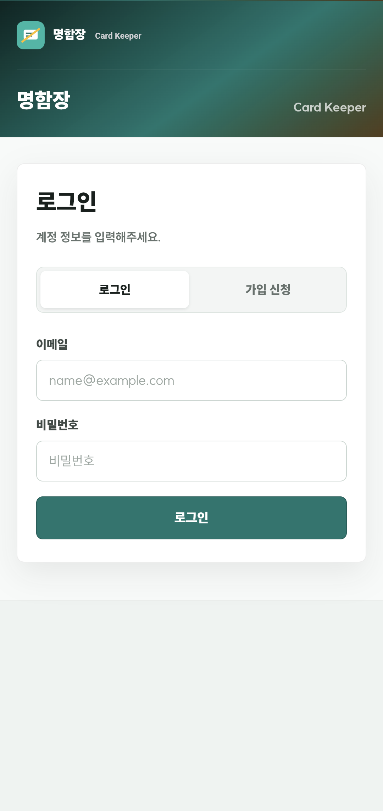
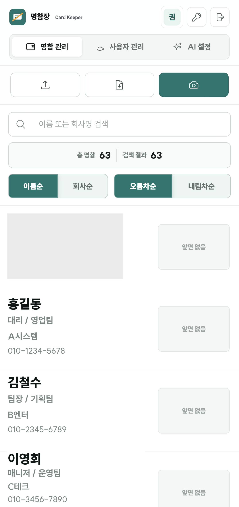
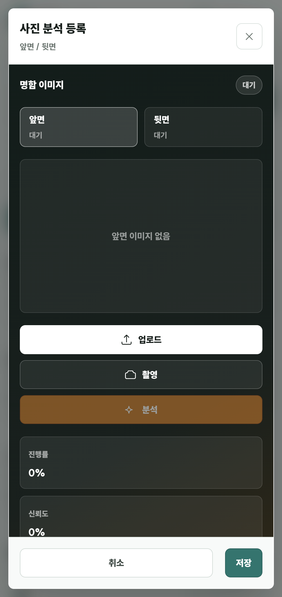
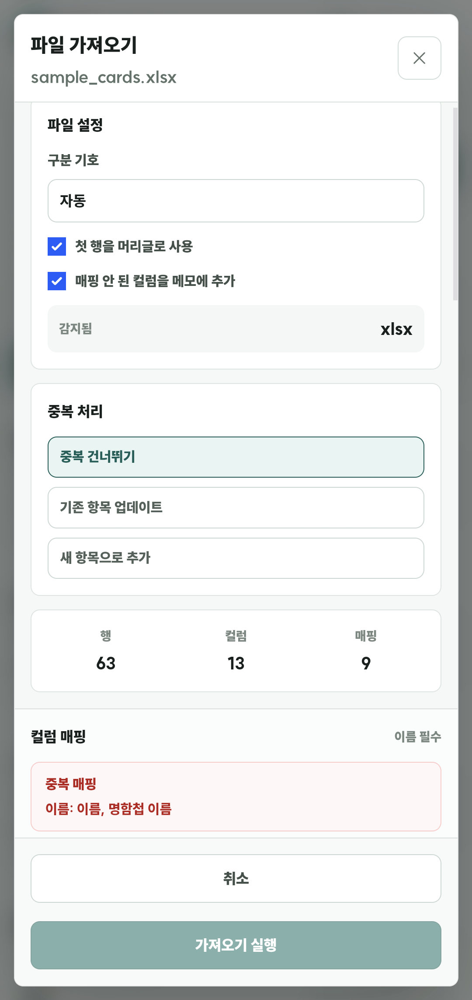

# Card Keeper

[한국어](README.md) · [Demo](https://bus.sub.nanoha.kr/)

Card Keeper is a personal business card management PWA and Android incoming-call business card display app built with [WIZ Framework](https://github.com/season-framework/wiz). It currently covers photo capture/upload OCR, CSV/TXT/XLSX import, CSV/XLSX export, admin-approved user access, AI OCR provider settings, Android card sync, and incoming-call display.

This project was developed with AI-assisted development.

## Current Status

- Regular users use `/cards` after login to search, sort, paginate, inspect details, edit, delete, register by photo analysis, import files, and export data.
- Admin users can open `/users` for user management and `/ai-settings` for AI settings from the top app bar.
- The PWA start URL is `/cards`, with a service worker and dynamic manifest route configured.
- Business card OCR uses server-side Tesseract by default and can use admin-enabled OpenAI, Google, or Ollama Vision providers as an AI fallback.
- Import supports CSV, TXT, and XLSX files with automatic column mapping, duplicate handling, and an option to append unmapped columns to memo.
- Export downloads the current search result as CSV or XLSX.
- The Android app is built with Gradle under `android/` and uses the WIZ mobile API for login, incremental card sync, image caching, and incoming-call card overlay/notification display.

## Screenshots

The README assets use ReviewOps screenshots. The list screen contains registered business card data, so only a derived image with dummy names, companies, and phone numbers is stored.

| Login | Card List |
|-------|-----------|
|  |  |

| Photo Analysis Registration | File Import |
|-----------------------------|-------------|
|  |  |

## First Access Flow

1. Sign in or request an account at `/access`.
2. The first registered account is created as `admin / active` for initial bootstrap.
3. Later accounts are created as `user / pending` and must be approved by an admin at `/users` before they can sign in.
4. After login, the default entry point and PWA start URL are `/cards`.

## Main Screens

- `/access`: login and signup request
- `/cards`: business card list, search, sort, pagination, detail view, photo OCR registration, import, and export
- `/my-card`: own card editing, design saving, image sharing, public link, and Android APK download
- `/users`: admin-only user approval, activation/blocking, and role changes
- `/ai-settings`: admin-only AI OCR provider, model, and API key settings

## Android App

The native app lives under `android/` and targets Galaxy / One UI 8.5 or later with JDK 17 and Compile/Target SDK 36. See [android/README.md](android/README.md) for SDK setup and real-device steps.

- The server base URL is `https://bus.sub.nanoha.kr/` through Android `BuildConfig.WEB_BASE_URL`.
- The app signs in to `/api/mobile/...` routes and incrementally syncs cards, phone aliases, and overlay images.
- Access/refresh tokens are stored through an Android Keystore-backed store, while cards and image cache are stored in app-private SQLite/files.
- Incoming calls are detected through `CallScreeningService` and a `PHONE_STATE` fallback; matched numbers show a card image or heads-up notification with recent call/SMS history.
- The mobile `/my-card` screen exposes an APK download button, and `/download/android-app.apk` serves `android/app/build/outputs/apk/debug/app-debug.apk`.

```bash
cd android
./scripts/setup-android-sdk.sh
./gradlew :app:assembleDebug
```

## Project Structure

```text
src/
├── app/
│   ├── page.access/        # Login / signup request
│   ├── page.cards/         # OCR / list / detail / import / export
│   ├── page.my_card/       # Own card editing / sharing / Android APK download
│   ├── page.users/         # Admin-only user management
│   ├── page.ai_settings/   # Admin-only AI OCR provider settings
│   └── layout.sidebar/     # Shared top app bar layout after auth
├── route/
│   ├── manifest/           # /manifest.json PWA manifest
│   ├── mobile-api/         # Android auth / sync / image API
│   └── android-apk-download/ # /download/android-app.apk
├── controller/
│   ├── base.py             # Session initialization and request parsing
│   ├── user.py             # Login, active status, session token validation
│   └── admin.py            # Admin permission validation
└── model/
    ├── db/
    │   ├── user.py
    │   ├── user_session.py
    │   ├── access_log.py
    │   ├── ai_setting.py
    │   └── business_card.py
    └── struct/
        ├── user.py
        ├── user_session.py
        ├── access_log.py
        ├── ai_setting.py
        └── business_card.py
android/
└── app/                    # Android incoming-call business card display app
```

## Local and Production Settings

`config/` is a local per-project configuration directory and is not committed. The repository tracks only the safe sample file under `config-sample/database.py`.

Production DB settings should be injected through deployment-specific `config/database.py` or runtime environment variables. Real passwords, API keys, session secrets, and DB backup files must not be committed.

| Environment Variable | Description |
|----------------------|-------------|
| `DB_TYPE` | Runtime DB type such as `mariadb`, `mysql`, or `sqlite` |
| `DB_HOST` | DB host |
| `DB_PORT` | DB port |
| `DB_NAME` | DB name |
| `DB_USER` | DB user |
| `DB_PASSWORD` | DB password provided only as an operational secret |

## Sensitive Data and Git Hygiene

- `.gitignore` excludes `config/`, `.env*`, `data/`, local DB files, key/pem/secret files, and build/test artifacts.
- `config-sample/` should contain examples only, not real connection details.
- AI Provider API keys are not returned as raw values in read responses; the API returns only `has_api_key`. The operational DB and backups still need to be treated as secrets because keys can be stored in callable form.
- If a local secret file has already been tracked, remove the value, run `git rm --cached <path>`, and rotate the secret if needed.

## OCR Strategy

- `POST /wiz/api/page.cards/analyze`: receives front/back images, applies EXIF orientation correction, preprocesses images, and runs Tesseract `kor+eng` OCR.
- When front and back images are analyzed together, front-side fields are preferred and empty values are supplemented from the back side.
- Default OCR uses `psm 11`, which works well for business card photos, and runs a supplemental `psm 6` pass only when required fields are insufficient.
- If the original OCR result is insufficient, the server analyzes 90, 270, and 180 degree rotation candidates and selects the highest-scoring orientation.
- If server OCR is insufficient and AI settings are enabled, OpenAI, Google Gemini, or Ollama Vision providers can be used as fallback.
- Server OCR requires OS packages `tesseract-ocr`, `tesseract-ocr-kor`, and `tesseract-ocr-eng` in addition to Python dependencies.

## Main API

### Auth

- `POST /wiz/api/page.access/login` - login
- `POST /wiz/api/page.access/signup` - signup request
- `POST /wiz/api/layout.sidebar/change_password` - change own password
- `GET /auth/check` - check session
- `GET /auth/logout` - logout

### Cards

- `GET /wiz/api/page.cards/list` - search/sort/paginate cards
- `POST /wiz/api/page.cards/analyze` - server OCR and AI fallback analysis
- `POST /wiz/api/page.cards/preview_import` - CSV/TXT/XLSX import preview
- `POST /wiz/api/page.cards/import_cards` - bulk import with column mapping
- `POST /wiz/api/page.cards/export_cards` - export current search result as CSV/XLSX
- `GET /wiz/api/page.cards/get` - fetch one card
- `POST /wiz/api/page.cards/save` - create or update a card
- `POST /wiz/api/page.cards/remove` - delete a card

### Android Mobile

- `GET /api/mobile/health` - check mobile API health
- `POST /api/mobile/auth/login` - Android app login and token issuance
- `POST /api/mobile/auth/refresh` - refresh access token
- `POST /api/mobile/auth/logout` - end mobile session
- `GET /api/mobile/cards/sync?since={iso8601}` - incremental card and phone alias sync
- `POST /api/mobile/cards/overlay-images` - batch-download overlay images
- `GET /api/mobile/cards/{id}/overlay-image?kind=front|back|generated` - download one overlay image
- `POST /api/mobile/devices/{id}/overlay-settings` - save Android display settings
- `GET /download/android-app.apk` - download Android debug APK

### Admin

- `GET /wiz/api/page.users/list` - user list
- `POST /wiz/api/page.users/approve` - approve signup
- `POST /wiz/api/page.users/activate` - activate account
- `POST /wiz/api/page.users/block` - block account
- `POST /wiz/api/page.users/update_role` - change role
- `GET /wiz/api/page.ai_settings/get_setting` - get AI settings
- `POST /wiz/api/page.ai_settings/models` - list provider models
- `POST /wiz/api/page.ai_settings/save` - save AI settings

## Verification

Playwright tests inject `season-wiz-project=main` and `season-wiz-devmode=true` cookies.

```bash
npm run playwright:install-deps
npm run playwright:install
npm run test:e2e
```

The default test target is `https://bus.sub.nanoha.kr`. Use `PLAYWRIGHT_BASE_URL` for another environment.

Server-side smoke tests can be run from the project root.

```bash
python tests/import_export_smoke.py
python tests/ocr_business_card_smoke.py
```

The OCR image smoke test requires real sample images under `data/` and a Tesseract runtime.

## License

This project is licensed under the [MIT License](LICENSE).
